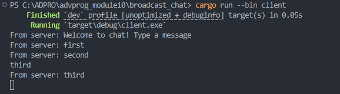
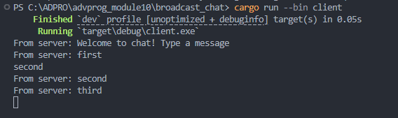
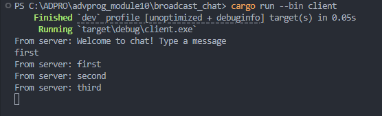
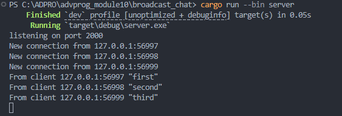
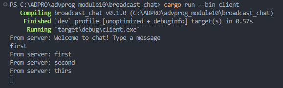
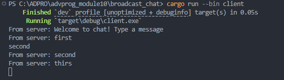
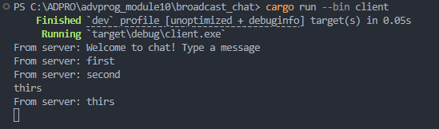
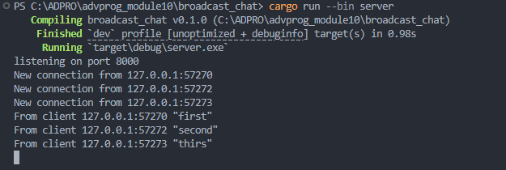

# Experiment 2.1: Original code, and how it run

## Cara Menjalankan

1. **Jalankan Server**
   
   Buka terminal dan jalankan perintah berikut di folder `broadcast_chat`:
   
   ```bash
   cargo run --bin server
   ```
   Server akan berjalan di `127.0.0.1:2000` dan siap menerima koneksi.

2. **Jalankan Tiga Client**
   
   Buka tiga terminal baru (masing-masing untuk satu client), lalu jalankan perintah berikut di setiap terminal:
   
   ```bash
   cargo run --bin client
   ```
   Setiap client akan terhubung ke server dan siap untuk mengirim/menampilkan pesan.

## Dokumentasi Hasil Eksekusi

Berikut adalah tangkapan layar (screenshot) saat menjalankan satu server dan tiga client, serta ketika masing-masing client mengirim pesan:

### Client 1


### Client 2


### Client 3


### Server


## Penjelasan

- Ketika server dijalankan, ia akan menunggu koneksi dari client pada port 2000.
- Setiap client yang terhubung akan menerima pesan "Welcome to chat! Type a message" dari server.
- Jika salah satu client mengetik dan mengirim pesan, pesan tersebut akan diteruskan (broadcast) ke semua client lain yang sedang terhubung, termasuk client yang mengirim pesan.
- Dengan demikian, setiap pesan yang dikirim oleh satu client akan muncul di semua jendela client yang aktif.

**Kesimpulan:**
- Program ini mendemonstrasikan komunikasi broadcast sederhana menggunakan WebSocket di Rust dengan bantuan library `tokio-websockets` dan `tokio`.
- Semua client dapat saling bertukar pesan secara real-time melalui server.

# Experiment 2.2: Modifying port

## Penjelasan Perubahan Port dan Protokol

- **Port yang digunakan sekarang adalah 8000** (bukan 2000). Perubahan ini harus dilakukan di dua tempat:
  - Pada server: di `TcpListener::bind("127.0.0.1:8000")` di file `src/bin/server.rs`.
  - Pada client: di `ClientBuilder::from_uri(Uri::from_static("ws://127.0.0.1:8000"))` di file `src/bin/client.rs`.
- **Protokol yang digunakan adalah WebSocket** dengan skema `ws://`. Ini didefinisikan pada client saat membuat koneksi ke server menggunakan `ClientBuilder::from_uri(...)`.
- Pastikan port pada server dan client sama agar koneksi berhasil.

## Dokumentasi Hasil Eksekusi Setelah Modifikasi

Berikut adalah tangkapan layar (screenshot) setelah port diubah ke 8000:

### Client 1


### Client 2


### Client 3


### Server


## Penjelasan Hasil Uji Coba

- Server berhasil menerima koneksi dari tiga client pada port 8000.
- Setiap client dapat mengirim pesan, dan pesan tersebut akan diterima oleh semua client lain secara real-time.
- Semua komunikasi tetap menggunakan protokol WebSocket (`ws://`).
- Tangkapan layar menunjukkan pesan yang dikirim dari satu client akan muncul di semua client lain dan juga di server.

**Kesimpulan:**
- Perubahan port tidak mempengaruhi fungsionalitas selama port yang sama digunakan di kedua sisi (server dan client).
- Protokol WebSocket tetap digunakan dan didefinisikan secara eksplisit di kode client.
- Program tetap berjalan dengan baik setelah perubahan port. 